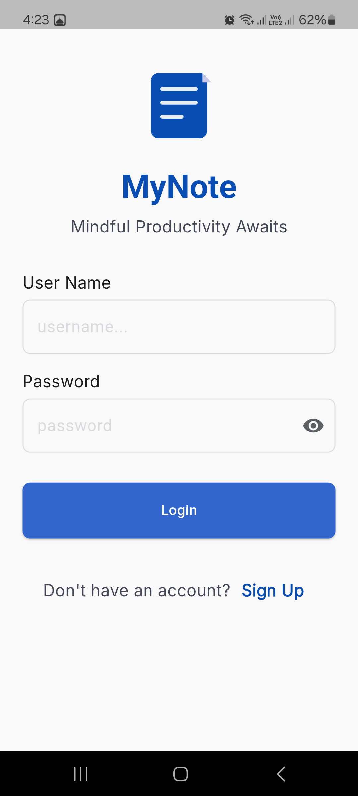
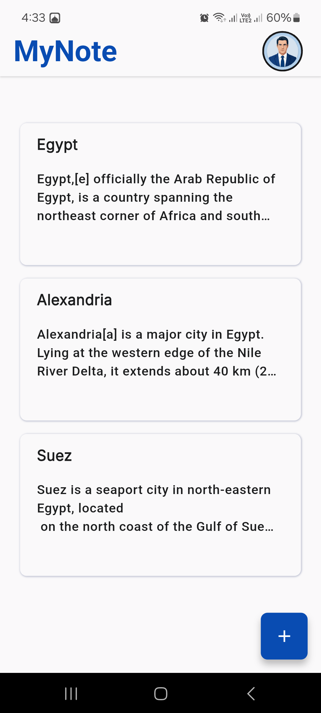
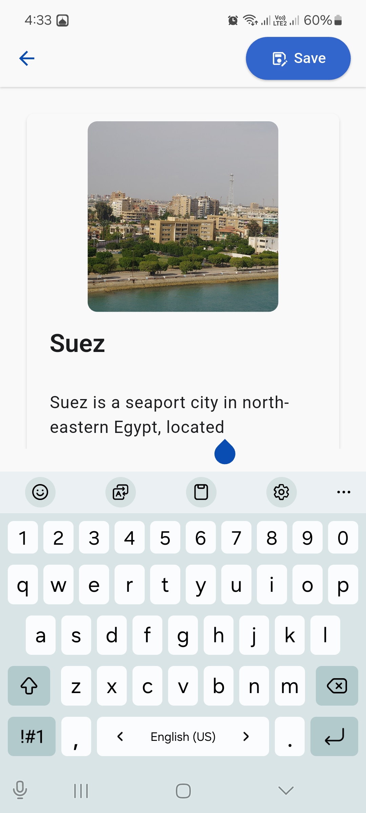
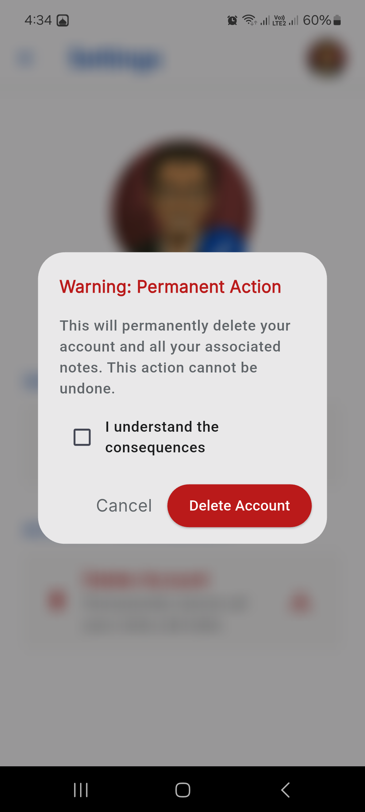

# MyNote: A Secure, Cross-Platform Mindful Productivity Application
### CS50x Final Project
#### Video Walkthrough: [Vimeo Link](https://vimeo.com/1208387367?share=copy&fl=sv&fe=ci)

---

## Project Overview
**MyNote** is a fully-featured, secure, and performant mobile notes application built using the Flutter framework and Dart programming language. Designed around the principles of "Mindful Productivity," the application allows users to seamlessly capture their thoughts, organize their ideas, secure their accounts with robust local authentication, and attach rich media such as images to their daily logs. 

Unlike simple note-taking concepts, **MyNote** implements a scalable relational database architecture locally on the device using SQLite via the `sqflite` package. It features full multi-user isolation, localized state management, complete user lifecycle configurations (Signup, Login, Security management, and Account deletion), and dynamically renders content based on custom, highly accurate typography, padding, and UI design standards.

---

## Application Screenshots

Here is a visual overview of the **MyNote** application interface, showcasing its clean design, user registration components, database persistence, and profile security features:

| 1. Welcome & Authentication | 2. Dashboard View | 3. Rich Media Note Entry |
|:---:|:---:|:---:|
|    *Login & Session Setup* |    *Dynamic SQLite ListView Builder* |    *Embedded Image Attachments* |

| 4. User Profile Settings | 5. Native Image Picker | 6. Account Protection |
|:---:|:---:|:---:|
|    *User Security Dashboard* |    *Dynamic Bottom Sheet Modal* |    *Destructive Cascade Warning* |

*(Note: Additional lifecycle workflows such as Password Updates and Account Creation follow the same precise UI design principles.)*

---

## Core Features
1. **Isolated Multi-User System:** Multiple profiles can be created locally. A dedicated session state machine ensures that users only see, update, or edit their respective notes.
2. **Robust SQL Injection Mitigation:** To ensure high structural integrity and application safety, all database transactions are filtered utilizing Parameterized Queries (`args` lists) via SQLite placeholders, preventing structural data leaks or local process crashes.
3. **Rich Text & Media Logging:** Users can write lengthy notes without memory bottlenecks and invoke native hardware capabilities via `image_picker` to snap camera photos or upload gallery files straight into their notes database.
4. **Adaptive Aesthetics:** The app reads system configurations to adapt natively to Brightness standards, enforcing custom meticulously structured Light and Dark themes.

---

## Project Structure and File Descriptions

The codebase strictly follows a clean architectural division separating data persistence models (`model/`) from interactive interface screens (`view/`):

### `lib/main.dart`
The centralized entry point of the Flutter runtime environment. It initializes the native binding configurations (`WidgetsFlutterBinding.ensureInitialized()`) to securely communicate with the host operating system's database directories before booting up the widget tree. It also evaluates user session continuity (`isLoggedin()`) to dynamically forward the routing pointer to either the `Home` dashboard or the `Login` boundary.

### `lib/model/sqldb.dart`
The foundational data layer of the application. It instantiates a singleton wrapper over the SQLite engine. Inside its lifecycle hook (`_onCreate`), it coordinates an atomic database `Batch` execution to safely deploy relational schemas:
* **`users` Table:** Holds primary keys, credentials, local profile media paths, timestamps, and boolean session flags.
* **`notes` Table:** Hosts foreign key relations (`user_id` referencing `users(id)`) guaranteeing cascading constraints, file references, titles, text payloads, and timestamp markers.
This file encapsulates explicit parameterized wrappers (`readData`, `insertData`, `updateData`, `deleteData`) to fully enforce **Prepared Statements**.

### `lib/view/` (Presentation Layer Screens)
* **`login.dart` & `signup.dart`:** Handle form validation through explicit state keys (`GlobalKey<FormState>`). Input constraints enforce text sanitation (e.g., username length boundaries and password confirmations). It verifies records safely via parameterized queries and establishes session updates.
* **`home.dart`:** Actively fetches localized user data and aggregates contextual relational notes mapping to the dynamic context user account. It presents a dynamic `ListView.builder` optimizing rendering viewport memory layouts, built alongside functional interactive dropdown popup navigation structures for settings or logging out.
* **`note.dart`:** Facilitates full CRUD lifecycle operations for singular records. It dynamically detects whether it operates under an active record injection context (`editMode == true`) to conditionally build deletion controls, initiate state mutations (`updateNote`), or dispatch newly configured data rows (`addNote`), while embedding native asynchronous access to the camera/gallery platform plugins.
* **`settings.dart` & `update_password.dart`:** Empower users with privacy controls. It implements an explicit system modal bottom sheet allowing users to copy locally picked profile picture crops into standard application directory paths. It provides strict database password mutations and enforces a destructive permanent cascade to completely erase a user account and their notes records under interactive confirmation validation loops.
* **`themes.dart` & `spacing.dart`:** Systemize visual variables. `spacing.dart` configures precise spacing constants preventing raw hardcoded layout deviations. `themes.dart` maps comprehensive `ThemeData` bindings setting specific font-family configurations (`Noto Serif`, `Inter`, `Public Sans`), custom input decorations, and explicit `ColorScheme` definitions for clean accessibility.

---

## Key Design Decisions
* **Why Parameterized SQLite over Plain String Interpolation?** Early structural iterations utilized direct string variables embedded into raw SQL syntax. Reflecting upon CS50 security lectures regarding malicious query shifts and memory crashes triggered by special characters (like apostrophes `'`), the raw functions were entirely refactored to consume array arguments (`?` markers). This entirely eliminates local system crashing risks and guarantees robust logical safety.
* **Why Local Framework Media Moving?** Relying purely on ephemeral `XFile` temp absolute path variables from standard picking libraries can cause asset rendering breakages if the OS wipes transient cache paths. Therefore, the implementation intentionally pulls structural file streams, copies them reliably to safe physical local paths through `path_provider`, and logs static path links into SQLite.

---

## Academic Honesty & AI Disclosure
In strict alignment with the **CS50 Academic Honesty Policy regarding generative AI systems**, the following declarations explicitly specify the localized usage patterns of automated assistance tools throughout the engineering lifecycle of this project:

1. **Learning and Conceptual Guidance (Gemini & ChatGPT):** Generative AI assistants were strictly utilized as **educational resources rather than collaborative builders**. The author consulted LLMs to deeply understand theoretical concepts, specifically how the *SQL Injection* vulnerability operates fundamentally and the best practices for mitigating it programmatically using placeholders. The AI served an advisory role to explain complex Flutter concepts, such as managing asynchronous state safety (`context.mounted`), and clarifying specific widget behaviors. All subsequent code transformations, database sanitizations, and structural logic were manually written, debugged, and integrated by the author.
2. **UI Design and Color Palette Generation (Stitch):** The visual design language, interface aesthetics, and corporate color configurations mapping across the application's Light and Dark themes (`themes.dart`) were generated and refined utilizing **Stitch**. This tool was employed to suggest cohesive, professional accessible palettes and structural layout styling, which the author then translated into precise Flutter `ThemeData` properties.
3. **Documentation Synthesis:** AI assistance was employed to translate the author's completed software architecture and design decisions into this standardized English `README.md` file.

*Every line of code executed, database schema deployed, and architectural assembly within this repository remains the intellectual property and hands-on creation of the author, ensuring full human-driven ownership.*
